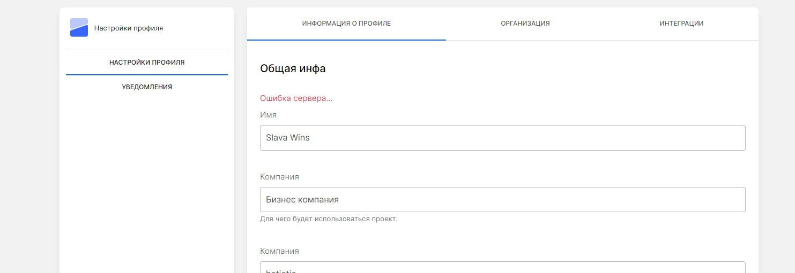

<p align="center">

</p>

## MrpProfile

Кароч изи пакет

## Установка из composer

```  
composer require slavawins/mrp-profile
```

Опубликовать js файлы, вью и миграции необходимые для работы пакета.
Вызывать команду:

```
php artisan vendor:publish --provider="MrpProfile\Providers\MrpProfileServiceProvider"
``` 

В роутере routes/web.php добавить

 ```
    Route::get('/profile', [\App\Http\Controllers\MrpProfile\UserMrpProfile::class, 'index'])->name('profile');
    Route::post('/profile/update_profile', [\App\Http\Controllers\MrpProfile\UserMrpProfile::class, 'update_profile'])->name('profile.update_profile');
    Route::post('/profile/profile_notify_if', [\App\Http\Controllers\MrpProfile\UserMrpProfile::class, 'profile_notify_if'])->name('profile.profile_notify_if');
    Route::post('/profile/profile_notify_type', [\App\Http\Controllers\MrpProfile\UserMrpProfile::class, 'profile_notify_type'])->name('profile.profile_notify_type');
    Route::post('/profile/industry', [\App\Http\Controllers\MrpProfile\UserMrpProfile::class, 'profile_industry'])->name('profile.industry');

 ```

В пользвоателя добавить. В PropertiesSetting. Это наборы всяких полей. Чтоб больше крутилок было.

 ```
        MrpProfileLibary::ExtendUser($config);
        MrpProfileLibary::ExtendUserProjectNotify($config);
 
 ``` 

Обновить поля пользователя

 ```
 php artisan mrp:migration User
 php artisan migrate
 
 ``` 

Переходим по адресу профиля, и смотрим как вкладки генерятся

 ```
/profile
 
 ``` 
